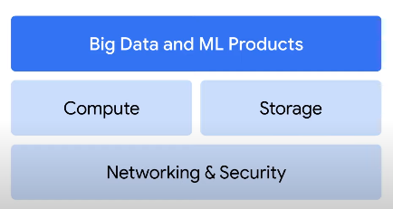
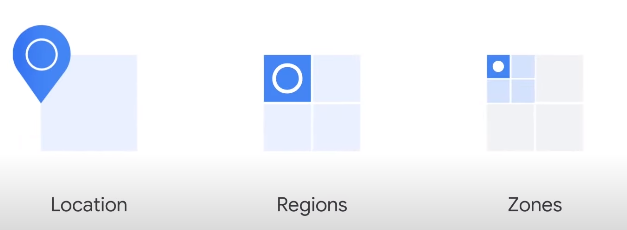
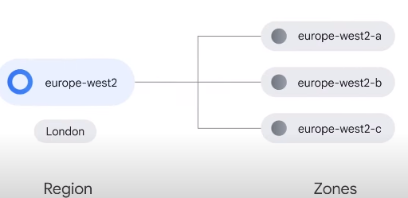

# Courese 1: Google Cloud Big Data and Machine Learning Fundamentals 

Pls see [here](https://www.cloudskillsboost.google/course_templates/3) for Course 1 from [Data Engineer Learning Path](https://www.cloudskillsboost.google/paths/16).  

Below are my notes from Course 1.  

## Contents

- 1.1 Big Data and Machine Learning on Google Cloud
- 1.2 Data Engineering for Streaming Data
- 1.3 Big Data with BigQuery
- 1.4 Machine Learning Options on Google Cloud  
- 1.5 The Machine Learning Workflow with Vertex AI  

## 1.1 Big Data and Machine Learning on Google Cloud

The Google Cloud infrastructure in terms of three layer:

- Networking and Security
- Compute and Storage
- Big data and ML Products

### Infrastructure locations

Google Cloud’s infrastructure is based in five major geographic locations: North America, South America, Europe, Asia, and Australia.

Having multiple service locations is important because choosing where to locate applications affects qualities like availability, durability, and latency, which measures the time a packet of information takes to travel from its source to its destination.

**Geographic locations contain regions and zones**

**Regions contain multiple zones**

A zone is an area where Google Cloud resources are deployed.